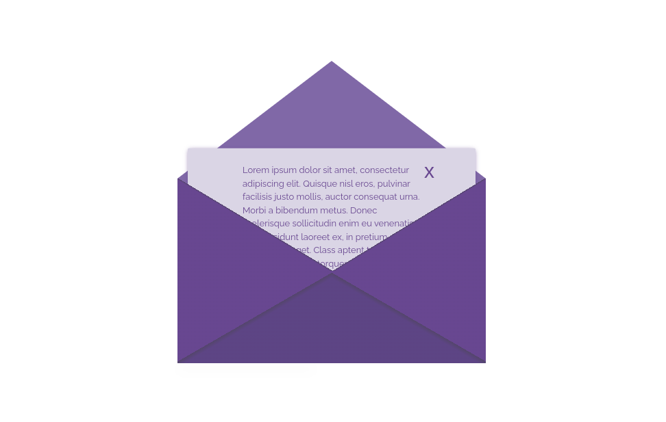

# Envelope Interaktif


### Introduction

This is an open envelope with new experiences.

### Requirement

- Node.js ^16.*
- NPM ^6.*

### Library

- [Bootstrap](https://getbootstrap.com/) ^5
- [Jquery](https://jquery.com/) ^3.5
- [GSAP](https://greensock.com/) ^3.2
- [Webpack](https://webpack.js.org/concepts/) ^5

### Installation

- click [Use this template](https://github.com/agungprsty/envelope/generate)
- git clone & change directory
- execute the following command

```
$ npm install       # yarn install

$ npm run build     # yarn run build

$ npm run dev       # yarn run dev
```

- if you want then it stays active and "watches" for updates
 
```
$ npm run watch     # yarn run watch
```
